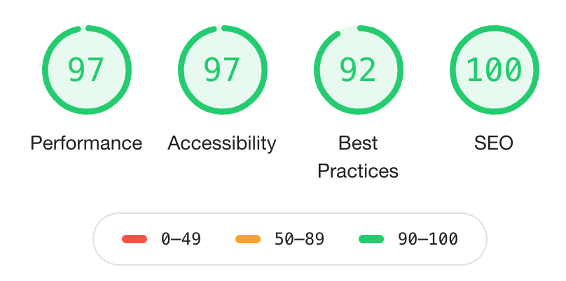

# Portfolio
Ongoing project

This is my personal portfolio. It is a single page, with navigation bar on top, projects, and contact information. Projects will be added as they are completed.

## Requirements
- I can access all of the portfolio webpage's content just by scrolling.
- I can click different buttons that will take me to the portfolio creator's different social media pages.
- I can see thumbnail images of different projects the portfolio creator has built (if you haven't built any websites before, use placeholders.)
- I navigate to different sections of the webpage by clicking buttons in the navigation.

## Experience learned
- Didn't use Bootstrap. Made everything from scratch. I used a lot of media queries to make it responsive.
- Learned how to use Photoshop to help with the design of my page.
- Learned how to use git and Github.
- Learned how to host my own website in Github.
- Purchased my own domain and linked it to Github.

## Audit
- Used Lighthouse to audit webpage

